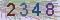
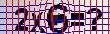

<h2 align="center">CAPTCHA-CV-OCR</h2>
<p align="center"><b>使用 CV (OpenCV) 和 OCR (Tesseract) 进行验证码识别</b></p>

## 快速入门

### 安装
因为所需的 OpenCV 支持模块 [opencv4nodejs](https://github.com/justadudewhohacks/opencv4nodejs) 体积较大，编译过程复杂，请手动全局安装，或者参考官方的安装指南：

```bash
npm i opencv4nodejs -g
```

第二个 Tesseract 支持模块 [tesseract.js](https://github.com/naptha/tesseract.js) 已写入 `package.json`

直接安装

```bash
npm i captcha-cv-ocr
```

或者

```bash
git clone https://github.com/PillarsZhang/captcha-cv-ocr
cd captcha-cv-ocr
npm install
npm link            #相当于安装为全局模块
```
### 测试

```bash
node test-all.js
```

### 用法

```javascript
const path = require("path");
const cvocrModule = require("captcha-cv-ocr");

var mode = "simplest";

(async () => {
    let cvocr = new cvocrModule(mode);  // mode 表示验证码的种类
    await cvocr.init(1);  //其中的1表示需要启动的 OCR Worker 数（多线程）
    let ans = await cvocr.recognize(path.join(__dirname, "docs/img", mode + ".jpg"));  //支持文件地址、Base64、Buffer形式
    console.log("ans:", ans)
    process.exit(0);
})()
```
## 开发

### 已支持
simplest | grids_and_equations | ...
:-: | :-: | :-:
 |  | ...

### 新支持

codes下的文件夹对应着不同种类的名字（自行命名），你可以参照已有的目录的格式创建新的识别库来适配其他各种验证码。请查阅 [opencv4nodejs](https://github.com/justadudewhohacks/opencv4nodejs) 和 [tesseract.js](https://github.com/naptha/tesseract.js) 的文档

## 维护者

- [Pillars Zhang](https://github.com/PillarsZhang)

## 感谢

- [opencv4nodejs](https://github.com/justadudewhohacks/opencv4nodejs)
- [tesseract.js](https://github.com/naptha/tesseract.js)

## License

- [MIT](https://opensource.org/licenses/MIT)
